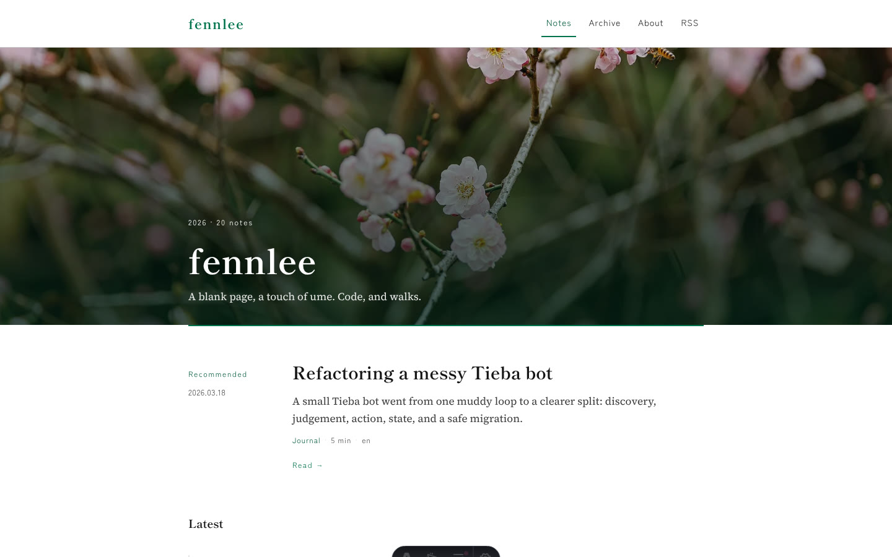
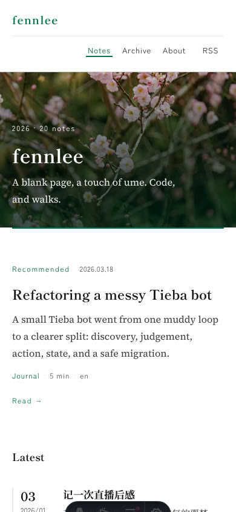

# ume

A magazine-style Astro blog theme. Mincho titles, gothic body, ume green. Light only.

[简体中文](README.zh-CN.md)





*Screenshots show a live site built on this theme, so they carry that site's own name and posts. Your content and config go in `ume.config.ts`.*

Use this repository as a GitHub template, or add it as a dependency and keep your own `ume.config.ts` at the site root.

## Features

- Markdown posts (`src/content/blog/`)
- Home: one landscape, then a lead note and a date-rail stream (thumb only when the note has a cover)
- Notes at `/notes/<slug>/`
- Archive by year, kinds (`/categories/`), tags, pagination
- About, RSS, 404, sitemap
- One config file: `ume.config.ts`
- Light theme

## Quick start

```bash
git clone https://github.com/fennlee/ume.git
cd ume
npm install
npm run dev
```

Node 22+.

## Project structure

```text
/
├── ume.config.ts        # site, home, about, archive
├── src/
│   ├── content/blog/     # posts
│   ├── pages/
│   ├── layouts/
│   ├── components/
│   └── styles/global.css # colors
└── public/
```

Posts use `title`, `date`, `description`, `category` (`note` | `travel`), optional `tags`, `lang`, `cover`, `images`.

## Configuration

Edit [`ume.config.ts`](ume.config.ts):

| Key | |
|---|---|
| `site` | name, motto, url, email, github, favicon, years |
| `nav` | primary links |
| `home` | title, lede, hero, streamLabel, pageSize, pin (slug; empty = newest) |
| `archive` / `tags` / `categories` | page titles |
| `about` | about page |
| `notFound` | 404 copy |
| `ui` | fixed UI strings |

Put photos in the site `public/` directory and point the config at those URLs. Do not patch theme source files.

Colors: `src/styles/global.css`.

## Commands

| Command | |
|---|---|
| `npm run dev` | local server |
| `npm run build` | production build |
| `npm run check` | type check |
| `npm run preview` | preview `dist/` |

## License

[MIT](LICENSE)
